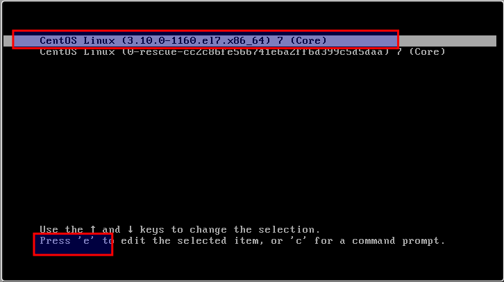
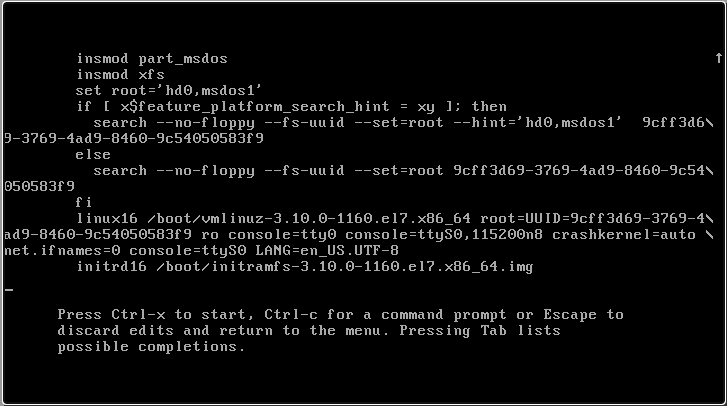
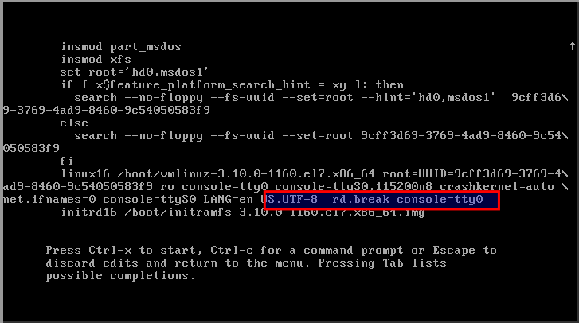
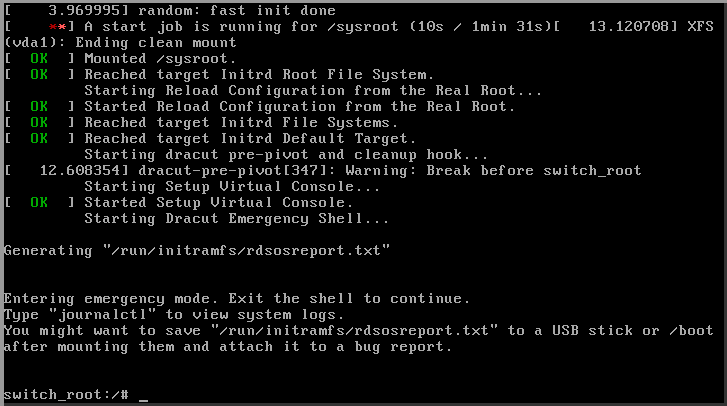

## Recover/Change ROOT password in Linux (RHEL,CentOS,Ubuntu)
---
**In** this document, we will learn how to recover/change root password in linux (RHEL, CentOS, Ubuntu etc) if root password is lost.

Reboot your Linux system and press any key at **kernel** loading page to stop timer to boot linux machine.




>**Note:** Please select latest kernel which one you are using...

Press **e** key to edit the file.



Here we have to change or add some arguments to reset or recove root password. Kindly find the line which start from **linux** and go to the end of that line.

and copy below syntax and paste at the end on line which starts from **linux**.

```bash
rd.break console=tty0
```


After edit the file press **ctrl-x** to continue. Then you will enter to console.



Now we run below command to reset the password:

```bash
mount -o remount,rw  /sysroot
mount
chroot /sysroot
passwd root
<enter new_password>
<re-enter new_password>
touch /.autorelabel
```

Type **exit** to reboot the system.

Your new password is now activated.
